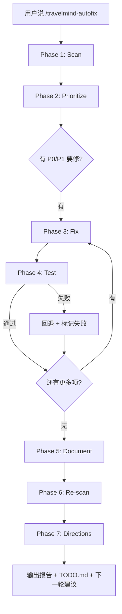

# TravelMind 自治优化循环（Autofix Loop）

本技能是 Phase 12.29 开发模式的自动化封装。一次性完成：

```
扫描（多维分析） → 优先级排序 → 逐项修复 → 测试验收 → 文档更新 → 再扫描（检查遗留） → 优化方向（下一轮建议）
```

## 用法

在项目根目录下直接说 `/travelmind-autofix`。

可选参数：
- `/travelmind-autofix --quick`：跳过扫描，直接跑测试→文档→再扫描（改完代码后的快速验证）
- `/travelmind-autofix --focus security`：只扫描安全类别
- `/travelmind-autofix --focus frontend`：只扫描前端类别
- `/travelmind-autofix --focus backend`：只扫描后端类别
- `/travelmind-autofix --focus ops`：只扫描运维类别

## 7 阶段详解

### Phase 1: Scan（多维扫描）

并行使用多个 agent 扫描不同维度，每维独立输出发现列表：

| 维度 | 扫描内容 | 典型发现数 |
|------|---------|-----------|
| 安全 | APP_DEBUG、CORS、device_id 校验、错误格式统一、认证缺失 | ~10 项 |
| 前端 | TypeScript 严格模式、代码分割、SSE 清理、ErrorBoundary、a11y、"类型图标映射完整性" | ~10 项 |
| 后端 | 并发安全、死代码、索引缺失、重复函数、内联 import、异常捕获 | ~15 项 |
| 测试 | API 集成测试、服务 mock 测试、管线测试、Profile新字段测试、DayCard图标渲染测试 | ~8 项 |
| 运维 | Dockerfile 最佳实践、entrypoint 容错、healthcheck、监控、日志 | ~10 项 |
| 📊 数据 | 城市 POI 覆盖率、缺坐标 POI 数、数据源验证状态、must_visit KB匹配率 | ~5 项 |
| 📉 评测 | 最新 evals/results/ 跑 eval_compare 对比基线、识别退化约束 | ~5 项 |
| 📦 依赖 | requirements.txt + package.json 过时库版本、安全漏洞 | ~3 项 |
| **📊 数据** | **城市 POI 覆盖率、缺坐标 POI 数、数据源验证状态、数据陈旧度** | **~5 项** |
| **📉 评测** | **最新 evals/results/ 跑 eval_compare 对比基线、识别退化约束** | **~5 项** |
| **📦 依赖** | **requirements.txt + package.json 过时库版本、安全漏洞** | **~3 项** |

每个发现包含：文件路径、行号、问题描述、修复方案、优先级（P0-P2）。

### Phase 2: Prioritize（优先级排序）

按规则自动排序：
- **P0（立即修）**：安全漏洞、功能错误、测试失败 — 本次循环必须修复
- **P1（本次修）**：性能问题、代码异味、文档漂移 — 本次循环应修复
- **P2（延后）**：代码风格、可选优化 — 输出到遗留清单

用户可指定 `--focus` 只跑某维度。不指定时全量扫描，P0+P1 全部修复。

### Phase 3: Fix（逐项修复）

按优先级从高到低逐项编辑代码。每项修复遵循：
1. 读目标文件确认当前内容
2. 应用最小变更（单行/单块 Edit）
3. 确认不再引入新问题（广度优先，单次修复只改一个文件）

**不修复的 P2 项**输出到 `docs/TODO.md` 遗留清单。

### Phase 4: Test（测试验收）

直接调用现有脚本链：

```bash
cd backend && bash scripts/fixcycle.sh --skip-eval
  # → pytest → npm run build → oxlint → 重启后端
  # 任意一步失败 → 回退最近一次修复 → 标记失败项 → 继续下一项
```

测试失败时的自动回退策略：
1. 用 `git diff` 抓取本次修复的文件变更
2. 用 `git checkout -- <files>` 回退
3. 在报告中标记该修复为「测试失败已回退」
4. 继续下一项修复，不阻塞整体循环

### Phase 5: Document（文档 + 自身更新）

更新项目文档和所有 SKILL.md 中的漂移数字，保证接手方看到的是最新真相。

#### 5a. 更新项目文档

使用现有 `update_docs.py` 脚本：

```bash
cd backend && python -X utf8 scripts/update_docs.py <最新eval结果> --phase <当前阶段> --test-count <新测试数>
```

项目文档更新清单：
- `docs/BASELINE.md` → 新 Phase 段落（说明变更 + 测试数 + 评测指标）
- `docs/PHASE_12.29_PLAN.md` → 完成状态标记
- `HANDOFF_TO_KIMICODE.md` → 头部快照 + §1 状态表 + §9 变更记录
- `CLAUDE.md` → 快速命令 + 项目技能数
- `README.md` → 知识库 + 评测 + 测试数

#### 5b. 自更新技能文件（自动化）

先运行专用脚本（零 AI 依赖）：

```bash
cd backend && python scripts/sync_skill_metadata.py
# 或先预览：
cd backend && python scripts/sync_skill_metadata.py --dry-run
```

此脚本自动完成：

| 更新项 | 来源 |
|--------|------|
| 所有 SKILL.md 中的测试数 | `pytest --collect-only` 实时统计 |
| 所有 SKILL.md 中的 POI 数 | `data/attractions.json` 实时读取 |
| 所有 SKILL.md 中的评测查询数 | `evals/queries.json["queries"]` 实时读取 |
| `CLAUDE.md` 中的技能数 + 测试数 | 正则替换 |
| `项目技能 (N 个)` 计数 | `ls skills/*/SKILL.md \| wc -l` |

#### 5c. 更新 memory 文件

```bash
cat /c/Users/Kenry/.claude/projects/D--TravelMindAgent/memory/MEMORY.md
```

更新：
- `current-status.md` → Phase 号 + 测试数 + 完成状态
- `MEMORY.md` → 索引行中的 Phase 号 + 测试数

### Phase 6: Re-scan（再扫描 + 遗留输出）

对修复后的代码跑一次轻量扫描，确认：
1. 已修复项确实消失（regression check）
2. 未引入新问题（广度扫描）
3. 输出遗留清单（未修复的 P2 + 新发现的 P2）

最终输出包含：
- ✅ 已修复数量
- ❌ 测试失败已回退数量
- 📋 遗留项清单（写入 `docs/TODO.md`）
- 📊 本轮改善摘要（测试数变化、代码质量变化）

### Phase 7: Directions（优化方向与建议）

对修复后的代码进行**方向性分析**，识别下一轮可以优化的重点领域：

| 分析维度 | 方法 | 产出 |
|---------|------|------|
| 🔭 数据缺口 | 查 `data/attractions.json` 各城市 POI 分布 + 缺坐标/缺标签统计 → 低覆盖城市列表 | 需补充数据的城市/品类 |
| 🌐 WebBridge 数据采集 | 对低覆盖城市用 `kimi-webbridge` 访问携程/百度地图/大众点评，获取真实 POI 名称+坐标+标签 | 已验证的待入库 POI（含 lat/lon 坐标） |
| 📉 评测短板 | 跑 `python scripts/eval_compare.py <最新>.json <基线>.json` 对比，找退化最多的 3 项约束 | 下一轮评测修复目标 |
| 📉 评测短板 | 查最新 `evals/results/` 中的 per_constraint 通过率 → 最低的 3 项 | 下一轮评测修复目标 |
| 🧹 代码债 | 结合 Phase 6 re-scan 遗留项 + `TODO.md` 已有清单 | 优先处理清单 |
| 📊 技术债务 | 编译器/语法版本、deprecation warning、废弃依赖 | 升级计划 |
| 🧪 测试覆盖 | 检查现有测试缺失的模块（grep `tests/test_` 覆盖 vs `app/` 模块） | 补充测试计划 |

**产出**：更新 `docs/TODO.md` 追加「下一轮方向」章节，包含：
1. 优先级排序（P0-P2）
2. 预估工作量（小/中/大）
3. 是否可自动修复（是/否）
4. 推荐执行的 autofix focus 参数

## 全局循环控制



## 与现有技能的关系

| 技能 | 关系 |
|------|------|
| `travelmind-fixcycle` | Phase 4 直接调用 |
| `travelmind-devcycle` | 后端重启 + 验证（Phase 4 子步骤） |
| `travelmind-eval` | Phase 5 文档更新引用评测结果 |
| `travelmind-test` | 冒烟/E2E/剧本测试（Phase 4 可选扩展） |
| `travelmind-data` | 数据管线（Phase 4 可选扩展） |

## 调用本技能的 CLI 快捷方式

```bash
# 交互界面的 / 命令
/autofix                    # 全量扫描 + 修复 + 测试 + 文档
/autofix --quick            # 跳过扫描，仅测试 + 文档 + 再扫描
/autofix --focus frontend   # 仅扫描和修复前端问题
```

## 失败处理

- 任意 Phase 失败 → 打印失败信息 + 建议手动介入 → 不阻塞后续 Phase
- 测试失败自动回退 → 标记失败项 → 继续循环
- 3 次连续修复失败 → 终止循环（防止无限回滚）
